# **📦 BuggyBuddy ETL [Microservice]**

## Overview

This microservice is an integral component of the [BuggyBuddy](http://example.com) project, serving as an **ETL (Extract, Transform, and Load)** pipeline application.

## Features

1. **Complete ETL Pipeline**:
   - Implements a comprehensive Extract, Transform, and Load data pipeline.
2. **Flexible Implementation**:
   - Provides the flexibility to seamlessly switch between different drivers or implementations, ensuring adaptability to changing technology stack requirements.
3. **Integration with RabbitMQ**:
   - Seamlessly communicates with other microservices via RabbitMQ, facilitating efficient integration and communication within the ecosystem.

## Data Pipeline

```mermaid
flowchart LR;
    data_extract["`**Data_Extraction**
    • Get raw data - Bugzilla API (*json*)`"]

    data_transform["`**Data_Transformation**
    • Remove duplicates
    • Get duplicated reports`"]

    data_load["`**Data_Transformation**
    • Load data into AWS S3 Bucket (*pandas.parquet*)`"]

    data_extract--> data_transform;
    data_transform --> data_load;
```



## Folder Structure


```
app/
├── src/
│   └── core/
│       ├── dtos/                 <- DTOs for transferring data between pipelines/modules.
│       ├── models/               <- Domain models representing data objects.
│       ├── ports/                <- Ports defining contracts for drivers.
│       ├── usecases/             <- Use cases implementing business logic.
│       └── utils/                <- Utility functions and helpers.
└── infrastructure/
    ├── data_drivers/             <- Data related drivers (data extractor, preprocessor, loader)
    ├── loggers/                  <- Logging utilities drivers.
    ├── message/                  <- Message broker drivers (RabbitMQ).
    └── utils/                    <- Additional utilities and helpers for infrastructure-related tasks.
```


## Tech Stack

- **Programming Language**: Python
- **ETL Framework**: pandas, numpy, sklearn
- **Data Wharehouse**: AWS S3 Bucket
- **Messaging**: RabbitMQ

## Installation

**1. Clone the repository:**

```bash
git clone <repository-url>
cd <repository-directory>
```

**2. Install & initialization:**

```bash
./entry_point.sh
```

**3. Configure the application environment:**

```bash
cp .env.example .env
```

> Edit the `.env` file and configure the necessary settings for your environment.

## Usage

BuggyBuddy ETL can be used using *direct execution* or *scheduled cron job (crontab)*. By using cron job, you are able to set based on prefered schedule.

**_Direct execution_**:

```bash
./run.sh
```

**_Scheduled cron job (default monthly)_**:

```bash
./cron.sh
```

> Make sure that `RabbitMQ` is installed and running on your machine before starting the app.

## Publised Event Messaging

The following types of events/messages are published by the BuggyBuddy ETL Pipeline Microservice:

1. **Pipeline_Extract**: Published when a new bug report is already extracted from Bugzilla. Below are *exchange*, *route*, and *data* of the message:

```bash
    exchange: 'etl_service',
    routing_key: 'extract_pipeline',
    data: {
      'status': 'SUCCESS' | 'FAILED',
      'message': 'ETL_PIPELINE [EXTRACT] - SUCCESS' | <error_message>
    }
```

2. **Pipeline_Transform**: Published after the bug report data has been transformed and prepared for loading the data. Below are *exchange*, *route*, and *data* of the message:

```bash
    exchange: 'etl_service',
    routing_key: 'transform_pipeline',
    data: {
      'status': 'SUCCESS' | 'FAILED',
      'message': 'ETL_PIPELINE [TRANSFORM] - SUCCESS' | <error_message>
    }
```

3. **Pipeline_Load**: Published when the processed bug report data is successfully loaded into the AWS S3 data warehouse. Below are *exchange*, *route*, and *data* of the message:

```bash
    exchange: 'etl_service',
    routing_key: 'load_pipeline',
    data: {
      'status': 'SUCCESS' | 'FAILED',
      'message': 'ETL_PIPELINE [LOAD] - SUCCESS' | <error_message>
    }
```

4. **Pipeline_All**: Published when all of the has been successfully executed. Below are *exchange*, *route*, and *data* of the message:

```bash
    exchange: 'etl_service',
    routing_key: 'all_pipeline',
    data: {
      'status': 'SUCCESS' | 'FAILED',
      'message': 'ETL_PIPELINE [ALL] - SUCCESS' | <error_message>
    }
```

## License

This microservice is licensed under the [MIT License](LICENSE). You are free to use, modify, and distribute this software for any purpose, with or without attribution.
